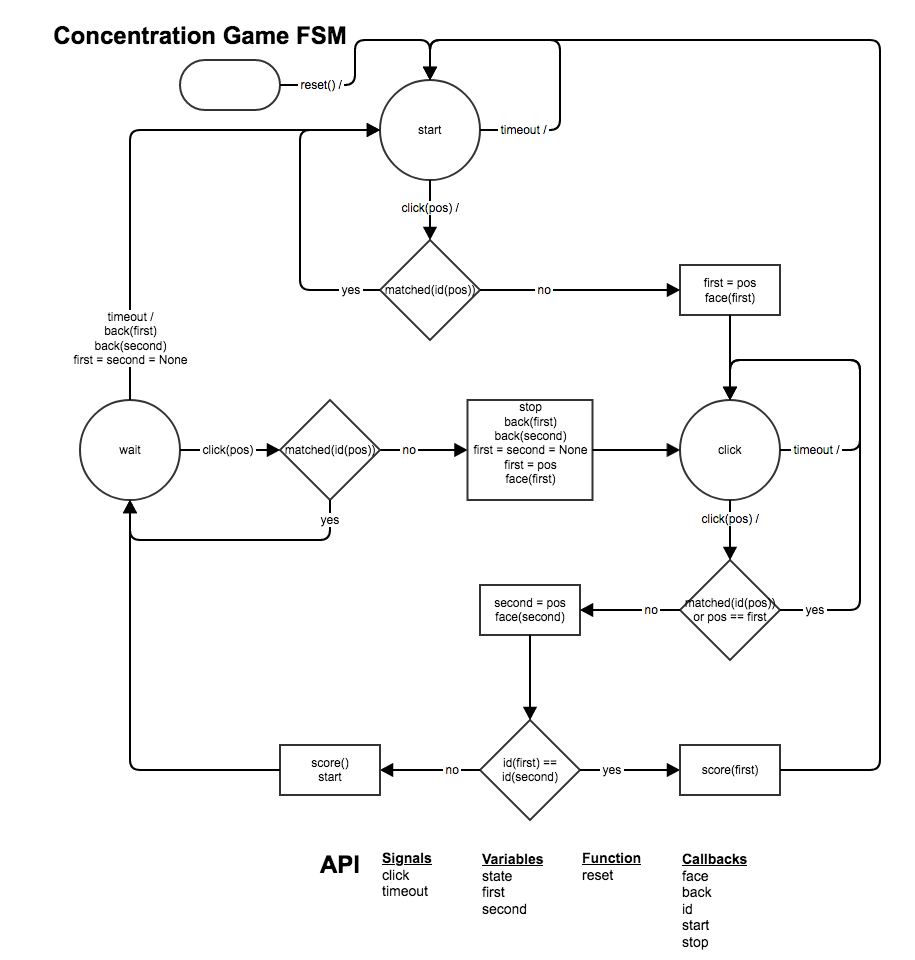

# Concentration Game

This is the final post-examination project of the Brookline High School [2020-2021 APCS-P](https://sites.google.com/psbma.org/david-petty/archive/2020-2021/apcsp) non-seniors. This codebase was originally developed on [https://replit.com/@bhsapcsp2021/Concentration-Game](https://replit.com/@bhsapcsp2021/Concentration-Game).

## Description

This is a concentration memory game involving standard playing cards. It is based on [Tkinter](https://docs.python.org/3/library/tkinter.html) and creates a grid of face-down cards in an approximate square. The possible number of pairs to match in the various games are: `(3, 6, 12, 14, 20, 24, 27, 30, 35, 42, 44, 48, 52)`. 

Score is determined... **HOW?**

## Modules

| File | Description |
| --- | --- |
| `src/app.py` | The main [Tkinter](https://docs.python.org/3/library/tkinter.html) GUI app. |
| `src/files.py` | Module that manages image file paths. |
| `src/gameplay.py` | Module that implements the gameplay [state machine](https://en.wikipedia.org/wiki/Mealy_machine). |
| `src/layout.py` | Module that calculates game card layouts. |
| `src/log.py` | Module that implements app [`logging`](https://docs.python.org/3/library/logging.html). |
| `src/main.py` | Module that initiates the app. |
| `src/score.py` | Module that implements game scoring. |
| `tests/test_layout.py` | Unit tests for `layout.py` (so far). |

### `app.py`

More [TK](https://en.wikipedia.org/wiki/To_come_(publishing)).

### `files.py`

More [TK](https://en.wikipedia.org/wiki/To_come_(publishing)).

### `gameplay.py`

[Gliffy](https://gliffy.com) [source](https://go.gliffy.com/go/
publish/13517385)

### `layout.py`

More [TK](https://en.wikipedia.org/wiki/To_come_(publishing)).

### `log.py`

More [TK](https://en.wikipedia.org/wiki/To_come_(publishing)).

### `main.py`

More [TK](https://en.wikipedia.org/wiki/To_come_(publishing)).

### `score.py`

More [TK](https://en.wikipedia.org/wiki/To_come_(publishing)).

### `tests/`

More [TK](https://en.wikipedia.org/wiki/To_come_(publishing)).

## TODO

Tasks for this project include:

- *This [documentation file](https://github.com/psb-2020-2021-apcsp/concentration-game/blob/main/README.md) should be completed*.
- In general, all code should follow [PEP-8](https://www.python.org/dev/peps/pep-0008/).
- Currently, the `Image` randomization takes place in `app.py` rather than `files.py`. There are two issues:
  - `Image`s are loaded with every change of game geometry (including the card back). It seems they should be loaded just once, but each time they must be resized &mdash; would that mean their quality would degrade with each game?
  - Should the `Image` randomization take place in `files.py`?
- Unit tests (using [`pytest`](https://docs.pytest.org/)) for *all* functions. (We has started using `unittest`).
- Add some [command-line options](https://docs.python.org/3/library/argparse.html) (perhaps initial game size, logging level, *etc.*?).
- Classes? Should we encapsulate everything and make it object-oriented?
- Make this a runnable app? (How?)
- *So much more!* (See our [notes](https://drive.google.com/file/d/1UhX4aK-9mBqioveEm5JWuqGeYFfpsKQS/view).)

[&#128279; permalink](https://psb-2020-2021-apcsp.github.io/concentration-game) and [&#128297; repository](https://github.com/psb-2020-2021-apcsp/concentration-game) for this page.
